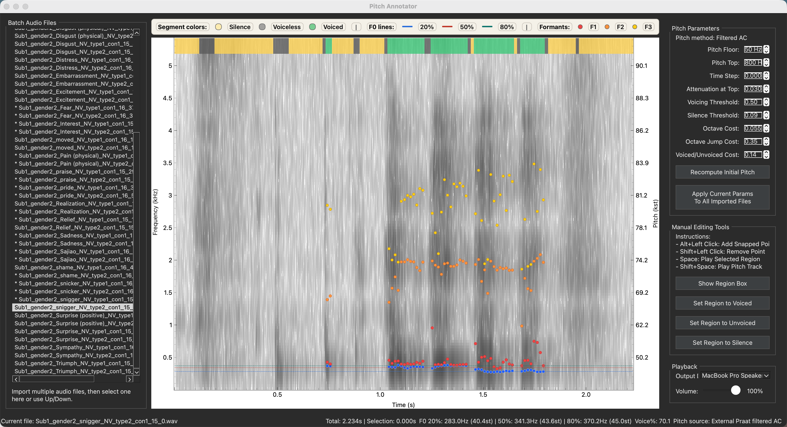

# Pitch Annotator

一款用于人工校正音高轨迹（F0）的桌面工具，适用于语音和声学研究。基于 PySide6、pyqtgraph 和 Parselmouth 构建。

> 本工具由 **Vibe Coding** 方式打造，正在持续优化中。欢迎提 Issue 反馈使用体验和改进建议。

<p align="center">
  
</p>

## 功能特性

- **批量导入**音频文件（.wav, .mp3, .m4a, .flac, .aiff, .ogg），逐条切换查看
- **频谱图 + 音高 + 共振峰** 同屏可视化（F0 / F1 / F2 / F3）
- **Praat 风格**音高提取，参数可调（音高上/下限、浊音阈值、八度跳变代价等）
- **手动编辑** — 加点、删点、拖拽移动单点；区间整体上下平移
- **区间标注** — 将选区标记为 Silence / Voiceless / Voiced，底部显示对应色带
- **缩放与导航** — 鼠标滚轮缩放（以音高轮廓为锚点）；底部水平滚动条精确定位时间轴
- **面板可调** — 拖动分隔条自由调整左侧文件列表和右侧控制面板的宽度
- **播放** — 播放原始选区音频或合成 F0 音高轨迹
- **撤销**支持（最多 100 步）
- **多格式导出**：
  - CSV（音高值 + 区间标注 + 参数记录）
  - Praat `.Pitch` 文件
  - 频谱图截图（PNG）
  - 声学特征 CSV（强度、jitter、shimmer、HNR、COG、频谱斜率、F0 统计、共振峰均值）
  - 批量导出：对所有已导入音频执行上述导出
- **外部 Praat** — 可配置本地 Praat 进行音高提取

## 安装

**环境要求：** Python 3.11 或 3.12

```bash
git clone https://github.com/zhihe-pan/pitch-annotator.git
cd pitch-annotator
python -m pip install -r requirements.txt
python main.py
```

### 可选：配置外部 Praat

安装 [Praat](https://www.fon.hum.uva.nl/praat/)，并设置环境变量 `PRAAT_PATH` 指向 `Praat.exe`（Windows）或 `praatcon`（macOS/Linux）。检测成功后状态栏会显示 "Pitch source: External Praat filtered AC"。

## 操作指南

### 鼠标操作

| 操作 | 手势 |
|------|------|
| 选中 pitch 点 | 左键单击 |
| 添加 pitch 点 | Alt + 左键单击 |
| 删除 pitch 点 | Alt + Shift + 左键单击 |
| 拖拽 pitch 点 | 左键按住已有 pitch 点并拖动 |
| 创建选区 | 左键在空白区拖动 |
| 选区整体上下平移 | Shift + 左键拖动 |
| 缩放 | 鼠标滚轮（以音高轮廓位置为锚点） |
| 滚动时间轴 | 拖动频谱图下方的水平滚动条 |

### 键盘快捷键

| 快捷键 | 功能 |
|--------|------|
| 空格 | 播放选区（原始音频） |
| Shift + 空格 | 播放选区（F0 合成音） |
| Ctrl+Z | 撤销 |
| 上 / 下方向键 | 上一个 / 下一个音频文件 |
| Ctrl+Shift+E | 导出当前文件所有结果 |
| Ctrl+Alt+Shift+E | 批量导出所有文件 |

### 典型工作流

1. **File → Import Audio Files…** — 选择一个或多个音频文件，设定初始音高参数
2. 观察频谱图和音高轨迹，通过缩放、滚动、拖拽面板来定位
3. 在控制面板中勾选 **Show Region** 来选择时间区间
4. 将区间标记为 Voiced / Voiceless / Silence
5. 手动修正 pitch 点：Alt+Click 加点，Alt+Shift+Click 删点，拖拽移动
6. **File → Export** 导出结果

### 音高参数说明

| 参数 | 含义 | 默认值 |
|------|------|--------|
| Pitch floor | 最低 F0 (Hz) | 50 |
| Pitch ceiling | 最高 F0 (Hz) | 800 |
| Time step | 帧步长（0 = 自动） | 0.0 s |
| Filtered AC attenuation | 上限频率处的衰减系数 | 0.03 |
| Voicing threshold | 浊音幅度阈值 | 0.50 |
| Silence threshold | 低于此幅度视为静音 | 0.09 |
| Octave cost | 八度跳变代价 | 0.055 |
| Octave jump cost | 八度不连续代价 | 0.35 |
| Voiced/unvoiced cost | 浊/清音状态切换代价 | 0.14 |

## 打包为桌面应用

```bash
python -m pip install -r requirements.txt
python build.py
```

输出在 `dist/`（PyInstaller 原始输出）和 `release/`（可分发压缩包）。

## 技术栈

- **Python 3.11+**
- **PySide6** — Qt GUI 框架
- **pyqtgraph** — 高性能绘图
- **praat-parselmouth** — 声学分析（频谱图、音高、共振峰）
- **librosa, scipy, numpy, soundfile** — 音频处理
- **PyInstaller** — 桌面打包

## 许可

MIT
